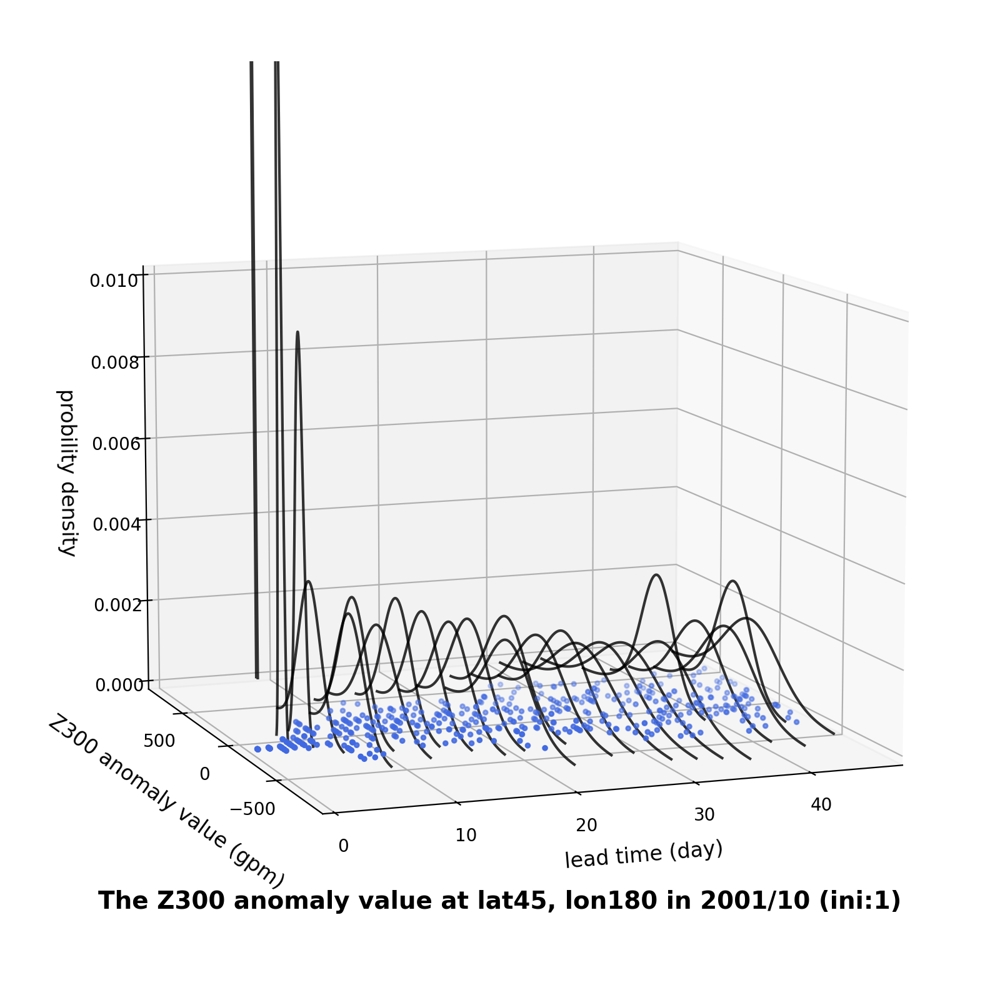

# ECMWF S2S Reforecast: Predictable Component Analysis
  A scientific pipeline to analyze atmospheric predictability and identify optimal predictable modes using ECMWF S2S data.
This project explores the predictability of the Northern Hemisphere 300 hPa Geopotential Height ($Z300$) by quantifying forecast uncertainty and identifying **Average Predictable Time (APT)** modes.

## Background
In subseasonal forecasting, atmospheric chaos leads to rapid uncertainty growth. This project implements a pipeline to filter noise, correct for Earth's geometry, and isolate the most predictable atmospheric patterns, such as the **PNA (Pacific–North American)** teleconnection.

## Install
This analysis requires Python 3.x and the following libraries:
```bash
pip install numpy scipy netCDF4 scikit-learn matplotlib cartopy
```

## Usage
The entire analysis workflow is documented in `code.ipynb`. The pipeline consists of:
1. **Data Aggregation:** Synthesizing raw NetCDF files into a structured 6D-Tensor.
2. **Climatology & Anomaly Calculation:** Isolating predictable signals by removing the seasonal mean.
3. **Uncertainty Visualization:** Modeling ensemble dispersion using Gaussian PDFs.
   <div align="center">
  
  <p>Figure 1: **Evolution of the $Z300$ anomaly distribution.** The sequence of Gaussian PDFs visualizes the growth of ensemble spread and forecast uncertainty over 47 lead days.</p>
  </div>
4. **Area-Weighted PCA:** Extracting dominant EOFs with a $\sqrt{\cos\phi}$ geometric correction.
5. **APTM Identification:** Solving for the most predictable linear combinations of PCs.

## Contribution
This is a research project. Suggestions for improving the predictability operator or alternative dimensionality reduction techniques are welcome.
